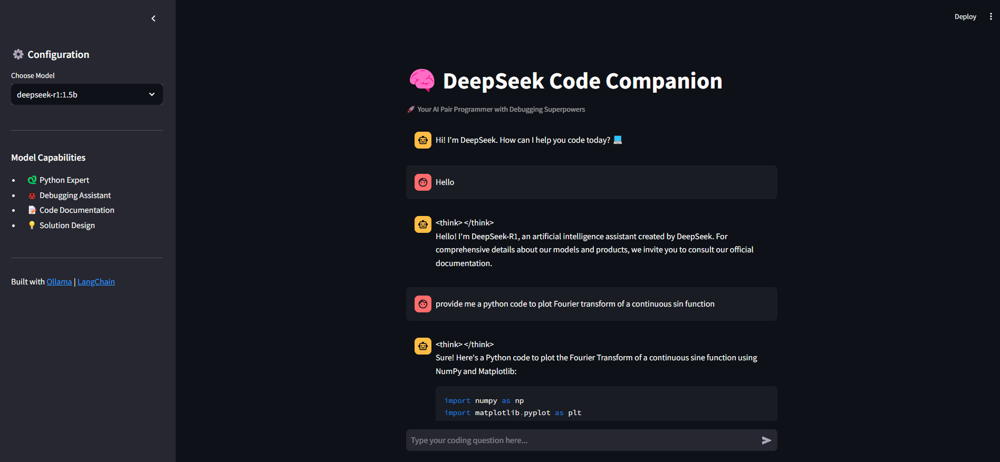

# **DeepSeekR1_LangChain_Ollama**  
A simple **GenAI app** leveraging **DeepSeek R1**, **LangChain**, and **Ollama** to run it on your local machine.

---

## **🚀 Prerequisites**
Before running the application, ensure you have **Ollama** installed and running on your local machine.

### **1️⃣ Start Ollama**
Run the following command to download and run the **DeepSeek-R1 model**:
```sh
ollama run deepseek-r:1.5b
```
> **Note:** We are using **DeepSeek-R1-Distill-Qwen-1.5B**, a distilled version of the DeepSeek R1 model, to **reduce setup time**.

---

## **📌 Setup Instructions**
### **Step 1: Create a Virtual Environment**
```sh
python -m venv .venv
```

### **Step 2: Activate the Virtual Environment**
- **Windows:**
  ```sh
  .venv\Scripts\activate
  ```
- **Mac/Linux:**
  ```sh
  source .venv/bin/activate
  ```

### **Step 3: Install Dependencies**
```sh
pip install -r requirements.txt
```

---

## **🌐 Application Interface**
Once the setup is complete run `streamlit run app.py` to launch the app. The website interface looks like this:



---

## **📝 Notes**
- **Rendering Time:** The response time may vary since DeepSeek **processes and "thinks" before responding**.
- **Optional Improvement:** If desired, the UI can be modified to **display the model's "thinking" process** for better user experience.

---

## **📌 Next Steps**
- Enhance **UI/UX** with **real-time response streaming**.
- Add **support for other Ollama-compatible models**.
- Optimize **LangChain integration** for better query handling.
